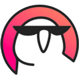

[OpenDataScience](https://ods.ai), a.k.a. ods.ai unites more than 40k Data Scientists and is thus one of the biggest IT communities in the world. Among dozens of ODS projects is organizing DataFest, the biggest Russian-speaking DS conference for researchers and practitioners. ODS also has its own educational mission presented here with Open Machine Learning Course [mlcourse.ai](https://mlcourse.ai).

### Slack
The main platform for all discussions. Fill in [this form](https://docs.google.com/forms/d/e/1FAIpQLSdjQB90EdZGV7Eelwo20WFC1ziP884FR_mtrsrdXPhEKIB3Ow/viewform) (the same one found on the [OpenDataScience](https://ods.ai) main page) to be invited. The course is discussed in the **#mlcourse_ai** channel. Alternatively, if you speak Russian, you can follow the **#mlcourse_ai_rus** channel or [this](https://vk.com/mlcourse) VK group.

### Firekeeper
[Yury Kashnitsky](https://yorko.github.io/). If you'd like to contribute to the course development, you can contact Yury via [Slack](https://ods.ai) (@yorko) or email to **mlcourse@ods.ai**. Questions on the course material, however, are discussed in the course channel **#mlcourse_ai**.

