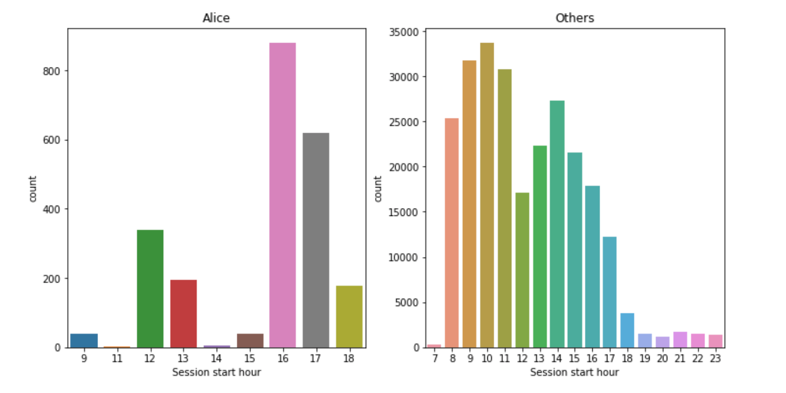

This roadmap guides you through self-paced mlcourse.ai. First, take a look at [course prerequisites](prerequisites). Be ready to spend around 3 months on passing the course, some 4-10 hours/week. Though it heavily depends on how much you will be willing to dive into Kaggle competitions (they are time-consuming but very rewarding in terms of skills) that we offer during this course. To get help, [join OpenDataScience](https://mlcourse.ai/contacts), discussions are held in the #mlcourse_ai Slack channel. For a general picture on what role all of Machine Learning plays in your would-be Data Science career, check the "Jump into Data Science" [video](https://youtu.be/FGuGg9F2VUs), it walks you through the preparation process for your first DS position once basic ML and Python are covered ([slides](https://www.slideshare.net/festline/how-to-jump-into-data-science)). In case you are already in DS, this course will be a good ML refresher. Good luck! 

#### Week 1. Exploratory Data Analysis

 

You definitely want to immediately start with Machine Learning and see math in action. But 70-80% of the time working on a real project is fussing with data, and here Pandas is very good, I use it in my work almost every day. This article describes the basic Pandas methods for preliminary data analysis. Then we analyze the data set on the churn of telecom customers and try to predict the churn without any training, simply relying on common sense. By no means should you underestimate such an approach.

1. Read the [article](https://mlcourse.ai/articles/topic1-exploratory-data-analysis-with-pandas/) (same in a form of a [Kaggle Notebook](https://www.kaggle.com/kashnitsky/topic-1-exploratory-data-analysis-with-pandas))
2. (opt.) watch a [video lecture](https://youtu.be/fwWCw_cE5aI)
3. Complete [assignment 1](https://www.kaggle.com/kashnitsky/assignment-1-pandas-and-uci-adult-dataset) where you'll be exploring demographic data (UCI "Adult"), and (opt.) check out the [solution](https://www.kaggle.com/kashnitsky/a1-demo-pandas-and-uci-adult-dataset-solution) 

#### Week 2. Visual Data Analysis

 

The role of visual data analysis is hard to overestimate, this is how new insights are found in data and how features are engineered. Here we discuss main data visualization techniques and how they are applied in practice. Also take a sneak peek into multidimensional feature space using the t-SNE algorithm, which sometimes is useful but mostly just draws such Christmas tree decorations.

1. Read two articles: 

 - ["Visual data analysis in Python"](https://mlcourse.ai/articles/topic2-visual-data-analysis-in-python/) (same as a [Kaggle Notebook](https://www.kaggle.com/kashnitsky/topic-2-visual-data-analysis-in-python))
 - ["Overview of Seaborn, Matplotlib and Plotly libraries"](https://mlcourse.ai/articles/topic2-part2-seaborn-plotly/) (same as a [Kaggle Notebook](https://www.kaggle.com/kashnitsky/topic-2-part-2-seaborn-and-plotly))

2. (opt.) watch a [video lecture](https://www.youtube.com/watch?v=WNoQTNOME5g)
3. Complete [assignment 2](https://www.kaggle.com/kashnitsky/a2-demo-analyzing-cardiovascular-data) where you'll be analyzing cardiovascular disease data, and (opt.) check out the [solution](https://www.kaggle.com/kashnitsky/a2-demo-analyzing-cardiovascular-data-solution) 

#### Week 3. Classification, Decision Trees and k Nearest Neighbors

 

Here we delve into machine learning and discuss two simple approaches to solving the classification problem. In a real project, you'd better start with something simple, and often you'd try out decision trees or nearest neighbors (as well as linear models, the next topic) right after even simpler heuristics. We discuss the pros and cons of trees and nearest neighbors. Also, we touch upon the important topic of assessing the quality of model predictions and performing cross-validation. The article is long, but decision trees, in particular, deserve it - they make a foundation for Random Forest and Gradient Boosting, two algorithms that you'll be likely using in practice most often.  

1. Read the [article](https://mlcourse.ai/articles/topic3-dt-knn/) (same as a [Kaggle Notebook](https://www.kaggle.com/kashnitsky/topic-3-decision-trees-and-knn))
2. (opt.) watch a video lecture coming in 2 parts:
 - the [theory](https://youtu.be/H4XlBTPv5rQ) behind decision trees, an intuitive explanation
 - [practice](https://youtu.be/RrVYO6Td9Js) with Sklearn decision trees
3. Complete [assignment 3](https://www.kaggle.com/kashnitsky/assignment-3-decision-trees) on decision trees, and (opt.) check out the [solution](https://www.kaggle.com/kashnitsky/a3-demo-decision-trees-solution) 

#### Week 4. Linear Classification and Regression

 

The following 5 articles may form a small brochure, and that's for a good reason: linear models are the most widely used family of predictive algorithms. These articles represent our course in a miniature: a lot of theory, a lot of practice. We discuss the theoretical basis of the Ordinary Least Squares method and logistic regression, as well as their merits in terms of practical applications. Also, crucial concepts like regularization and learning curves are introduced. In the practical part, we apply logistic regression to the [task](https://inclass.kaggle.com/c/catch-me-if-you-can-intruder-detection-through-webpage-session-tracking2) of user identification on the Internet, it's a Kaggle Inclass competition (a.k.a "Alice", we go on with this competition in Week 6).

*It's better to admit that this week's material would rather take you 2-3 weeks to digest and practice, that's fine. But for consistency with article numbering, we stick to "Week 4" for this topic.*

1. Read 5 articles:
 - ["Ordinary Least Squares"](https://mlcourse.ai/articles/topic4-part1-linreg/) (same as a [Kaggle Notebook](https://www.kaggle.com/kashnitsky/topic-4-linear-models-part-1-ols))
 - ["Logistic Regression"](https://mlcourse.ai/articles/topic4-part2-logit/) (same as a [Kaggle Notebook](https://www.kaggle.com/kashnitsky/topic-4-linear-models-part-2-classification))
 - ["Regularization"](https://mlcourse.ai/articles/topic4-part3-regularization/) (same as a [Kaggle Notebook](https://www.kaggle.com/kashnitsky/topic-4-linear-models-part-3-regularization))
 - ["Pros and Cons of Linear Models"](https://mlcourse.ai/articles/topic4-part4-applications/) (same as a [Kaggle Notebook](https://www.kaggle.com/kashnitsky/topic-4-linear-models-part-4-more-of-logit)) 
 - ["Validation and learning curves"](https://mlcourse.ai/articles/topic4-part5-validation/) (same as a [Kaggle Notebook](https://www.kaggle.com/kashnitsky/topic-4-linear-models-part-5-validation)) 
2. Watch a video lecture on logistic regression coming in 2 parts:
 - the [theory](https://youtu.be/ne-MfRfYs_c) behind LASSO and Ridge regression models
 - [practical part](https://www.youtube.com/watch?v=7o0SWgY89i8), beating baselines in the "Alice" [competition](https://inclass.kaggle.com/c/catch-me-if-you-can-intruder-detection-through-webpage-session-tracking2)
3. Watch a video lecture on regression and regularization coming in 2 parts:
 - the [theory](https://www.youtube.com/watch?v=l3jiw-N544s) behind linear models, an intuitive explanation
 - [business case](https://youtu.be/B8yIaIEMyIc), where we discuss a real regression task - predicting customer Life-Time Value 
3. Complete [assignment 4](https://www.kaggle.com/kashnitsky/a4-demo-sarcasm-detection-with-logit) on sarcasm detection, and (opt.) check out the [solution](https://www.kaggle.com/kashnitsky/a4-demo-sarcasm-detection-with-logit-solution) 
4. Complete [assignment 6](https://www.kaggle.com/kashnitsky/assignment-6-linear-models-and-rf-for-regression) (sorry for misleading numbering here) on OLS, Lasso and Random Forest in a regression task, and (opt.) check out the [solution](https://www.kaggle.com/kashnitsky/a6-demo-regression-solution) 

#### Week 5. Bagging and Random Forest

 

Yet again, both theory and practice are exciting. We discuss why "wisdom of a crowd" works for machine learning models, and an ensemble of several models works better than each one of the ensemble members. In practice, we try out Random Forest (an ensemble of many decision trees) - a "default algorithm" in many tasks. We discuss in detail the numerous advantages of the Random Forest algorithm and its applications. No silver bullet though: in some cases, linear models still work better and faster.

1. Read 3 articles: 
 - ["Bagging"](https://mlcourse.ai/articles/topic5-part1-bagging/) (same as a [Kaggle Notebook](https://www.kaggle.com/kashnitsky/topic-5-ensembles-part-1-bagging))
 - ["Random Forest"](https://mlcourse.ai/articles/topic5-part1-bagging/) (same as a [Kaggle Notebook](https://www.kaggle.com/kashnitsky/topic-5-ensembles-part-2-random-forest)) 
 - ["Feature Importance"](https://mlcourse.ai/articles/topic5-part3-feature-importance/) (same as a [Kaggle Notebook](https://www.kaggle.com/kashnitsky/topic-5-ensembles-part-3-feature-importance))
2. Watch a video lecture coming in 3 parts:
 - [part 1](https://www.youtube.com/watch?v=neXJL-AqI_c) on Random Forest
 - [part 2](https://www.youtube.com/watch?v=aBOMYqGUlWQ) on classification metrics
 - [business case](https://www.youtube.com/watch?v=FmKU-1LZGoE&feature=youtu.be), where we discuss a real classification task - predicting customer payment
3. Complete [assignment 5](https://www.kaggle.com/kashnitsky/assignment-5-logit-and-rf-for-credit-scoring) where you compare logistic regression and Random Forest in the credit scoring problem, and (opt.) check out the [solution](https://www.kaggle.com/kashnitsky/a5-demo-logit-and-rf-for-credit-scoring-sol) 

#### Week 6. Feature Engineering and Feature Selection

  

Feature engineering is one of the most interesting processes in the whole of ML. It's an art or at least craft and is therefore not yet well-automated. The article describes the ways of working with heterogeneous features in various ML tasks with texts, images, geodata, etc. Practice with the ["Alice" competition](https://www.kaggle.com/c/catch-me-if-you-can-intruder-detection-through-webpage-session-tracking2) is going to convince you how powerful feature engineering can be. And that it's a lot of fun as well!

1. Read the [article](https://mlcourse.ai/articles/topic6-features/) (same in a form of a [Kaggle Notebook](https://www.kaggle.com/kashnitsky/topic-6-feature-engineering-and-feature-selection))
2. **Kaggle:** Now that you've beaten simple baselines in the ["Alice" competition](https://www.kaggle.com/c/catch-me-if-you-can-intruder-detection-through-webpage-session-tracking2) (see Topic 4), check out a bit more advanced Notebooks:
 - ["Correct time-aware cross-validation scheme"](https://www.kaggle.com/kashnitsky/correct-time-aware-cross-validation-scheme)
 - ["Model validation in a competition"](https://www.kaggle.com/kashnitsky/model-validation-in-a-competition)

   Go on with feature engineering and try to achieve ~ 0.955 (or higher) ROC AUC on the [Public Leaderboard](https://www.kaggle.com/c/catch-me-if-you-can-intruder-detection-through-webpage-session-tracking2/leaderboard). Alternatively, if a better solution is already shared by the time you join the competition, try to improve the best publicly shared solution by at least 0.5%. However, **please do not share high-performing solutions**, it ruins the competitive spirit of the competition, and also hurts some other courses which also have this competition in their syllabus.

#### Week 7. Unsupervised Learning: Principal Component Analysis and Clustering

 

Here we turn to the vast topic of unsupervised learning, it's about the cases when we have data but it is unlabeled, no target feature to predict like in classification/regression tasks. Most of the data out there is unlabeled, and we need to be able to make use of it. We discuss only 2 types of unsupervised learning tasks - clustering and dimensionality reduction. 

1. Read the [article](https://mlcourse.ai/articles/topic7-unsupervised/) (same in a form of a [Kaggle Notebook](https://www.kaggle.com/kashnitsky/topic-7-unsupervised-learning-pca-and-clustering))
2. (opt.) watch a video lecture coming in 2 parts:
 - ["Principal Component Analysis"](https://youtu.be/-AswHf7h0I4)
 - ["Clustering"](https://youtu.be/eVplCo-w4XE)
3. Complete [assignment 7](https://www.kaggle.com/kashnitsky/assignment-7-unupervised-learning) where you analyze data coming from mobile phone accelerometers and gyroscopes to cluster people into different types of physical activities, and (opt.) check out the [solution](https://www.kaggle.com/kashnitsky/a7-demo-unsupervised-learning-solution) 

#### Week 8. Vowpal Wabbit: Learning with Gigabytes of Data

 

 The theoretical part here covert the analysis of Stochastic Gradient Descent, it was this optimization method that made it possible to successfully train both neural networks and linear models on really large training sets. Here we also discuss what can be done in cases of millions of features in a supervised learning task ("hashing trick") and move on to Vowpal Wabbit, a utility which allows you to train a model with gigabytes of data in a matter of minutes, and sometimes of acceptable quality. We consider several cases including StackOverflow questions tagging with a training set of several gigabytes. 

1. Read the [article](https://mlcourse.ai/articles/topic8-sgd-vw/) (same in a form of a [Kaggle Notebook](https://www.kaggle.com/kashnitsky/topic-7-unsupervised-learning-pca-and-clustering))
2. (opt.) watch a video lecture coming in 2 parts:
 - ["Stochastic Gradient Descent"](https://youtu.be/EUSXbdzaQE8)
 - ["Vowpal Wabbit"](https://www.youtube.com/watch?v=gyCjancgR9U)
3. Complete [assignment 8](https://www.kaggle.com/kashnitsky/assignment-8-implementing-online-regressor) "Implementing online regressor" which walks you through implementation from scratch, very good for the intuitive understanding of the algorithm. Optionally, check out the [solution](https://www.kaggle.com/kashnitsky/a8-demo-implementing-online-regressor-solution) 

#### Week 9. Time Series Analysis with Python

 

Here we discuss various approaches to work with time series: what data preparation is necessary, how to get short-term and long-term predictions. We walk through various types of time series models, from simple moving average to gradient boosting. We also take a look at the ways to search for anomalies in time series and discuss the pros and cons of these methods.

1. Read the following two articles:
 - ["Time series analysis in Python"](https://mlcourse.ai/articles/topic9-part1-time-series/) (same in a form of a [Kaggle Notebook](https://www.kaggle.com/kashnitsky/topic-9-part-1-time-series-analysis-in-python))
 - ["Predicting future with Facebook Prophet"](https://mlcourse.ai/articles/topic9-part2-prophet/) (same in a form of a [Kaggle Notebook](https://www.kaggle.com/kashnitsky/topic-9-part-2-time-series-with-facebook-prophet))
2. (opt.) watch a [video lecture](https://youtu.be/_9lBwXnbOd8)
3. Complete [assignment 9](https://www.kaggle.com/kashnitsky/assignment-9-time-series-analysis) where you'll get hands dirty with ARIMA and Prophet, and (opt.) check out the [solution](https://www.kaggle.com/kashnitsky/a9-demo-time-series-analysis-solution)

#### Week 10. Gradient Boosting   

 

Gradient boosting is one of the most prominent Machine Learning algorithms, it founds a lot of industrial applications. For instance, the Yandex search engine is a big and complex system with gradient boosting (MatrixNet) somewhere deep inside. Many recommender systems are also built on boosting. It is a very versatile approach applicable to classification, regression, and ranking. Therefore, here we cover both theoretical basics of gradient boosting and specifics of most wide-spread implementations - Xgboost, LightGBM, and Catboost.

1. Read the [article](https://mlcourse.ai/articles/topic10-boosting/) (same in a form of a [Kaggle Notebook](https://www.kaggle.com/kashnitsky/topic-10-gradient-boosting))
2. (opt.) watch a video lecture coming in 2 parts:
 - [part 1](https://youtu.be/g0ZOtzZqdqk), key ideas behind major implementations: Xgboost, LightGBM, and CatBoost
 - [part 2](https://youtu.be/V5158Oug4W8), practice
3. **Kaggle:** Take a look at the "Flight delays" [competition](https://www.kaggle.com/c/flight-delays-fall-2018) and a starter with [CatBoost](https://www.kaggle.com/kashnitsky/mlcourse-ai-fall-2019-catboost-starter-with-gpu). Start analyzing data and building features to improve your solution. Try to improve the best publicly shared solution by at least 0.5%. But still, **please do not share high-performing solutions**, it ruins the competitive spirit.

